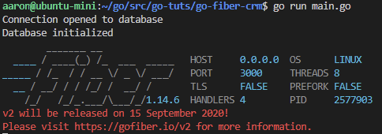
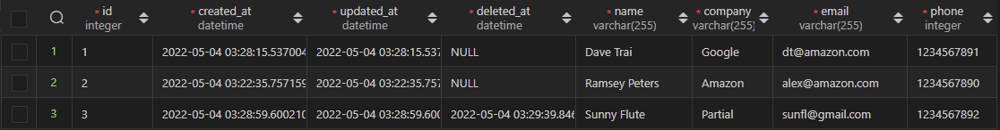
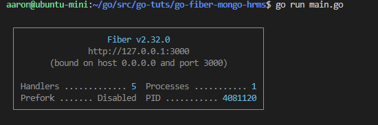
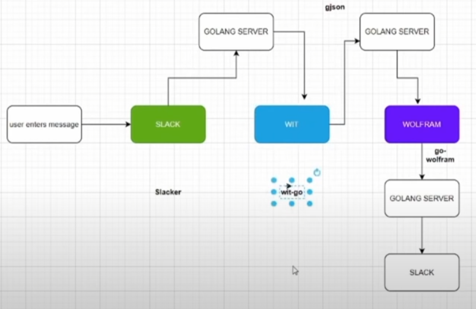
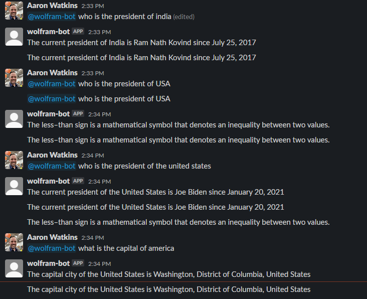

# Tutorials from free code camp [youtube video here](https://www.youtube.com/watch?v=jFfo23yIWac&t=22s)

## Slack File Bot

image of slack file bot output

  

---

## Email Validation Tool

image of slack file bot output // provide a domain and the app will return if its a valid domain or not

  

---

## AWS lambda func

### setup

create role
```bash
aws iam create-role --role-name lambda-ex --assume-role-policy-document '{"Version": "2012-10-17","Statement": [{ "Effect": "Allow", "Principal": {"Service": "lambda.amazonaws.com"}, "Action": "sts:AssumeRole"}]}'
```

create file in the root directory of your main.go called trust-policy.json
```json
{
  "Version": "2012-10-17",
  "Statement": [
    {
      "Effect": "Allow",
      "Principal": {
        "Service": "lambda.amazonaws.com"
      },
      "Action": "sts:AssumeRole"
    }
  ]
}
```

point the aws-cli to the trust policy file just created
```bash
aws iam create-role --role-name lambda-ex --assume-role-policy-document file://trust-policy.json
```

configure policy/role
```bash
aws iam attach-role-policy --role-name lambda-ex --policy-arn arn:aws:iam::aws:policy/service-role/AWSLambdaBasicExecutionRole
```

build the go binary (if trouble, run 'go mod tidy')
```bash
go build main.go
```

zip the built "main" into a zip called function.zip
```bash
zip function.zip main
```

create the lambda function with aws cli (replace 123456789012 with your aws account id)
```bash
aws lambda create-function --function-name test-lambda-go-func --zip-file fileb://function.zip --handler main --runtime go1.x --role arn:aws:iam::123456789012:role/lambda-ex
```

invoke the lambda function
```bash
aws lambda invoke --function-name test-lambda-go-func --cli-binary-format raw-in-base64-out --payload '{"What is your name?": "Jim", "How old are you?": 33}' output.txt
```

---

## Go Fiber CRM

Console Output:



Database View:



## Installation

`NOTE: May need to install sqlite`

```bash
sudo apt install sqlite
```

---

## Go Fiber MongoDB HRMS (Human Resource Management System)

Console Output:



---

## nlp-bot (natural language processing)

ABOUT: This app uses Slack, wit.ai, wolfram, and go to create a slack bot that takes a general request and returns an answer.

### Block Diagram:




### In Action:



---

## Discord Ping Bot

ABOUT: From a discord ping bot [series](https://www.youtube.com/playlist?list=PL5dTjWUk_cPZwsRo2ZPtgp3KejezGQeae) with Akhil. 

### In Action


NOTE:
discord link for authorizing bots: 
> `https://discord.com/oauth2/authorize?client_id=<APPLICATION_ID>&scope=bot`

where, APPLICATION_ID is found in your [discord developer portal](https://discord.com/developers/applications)
